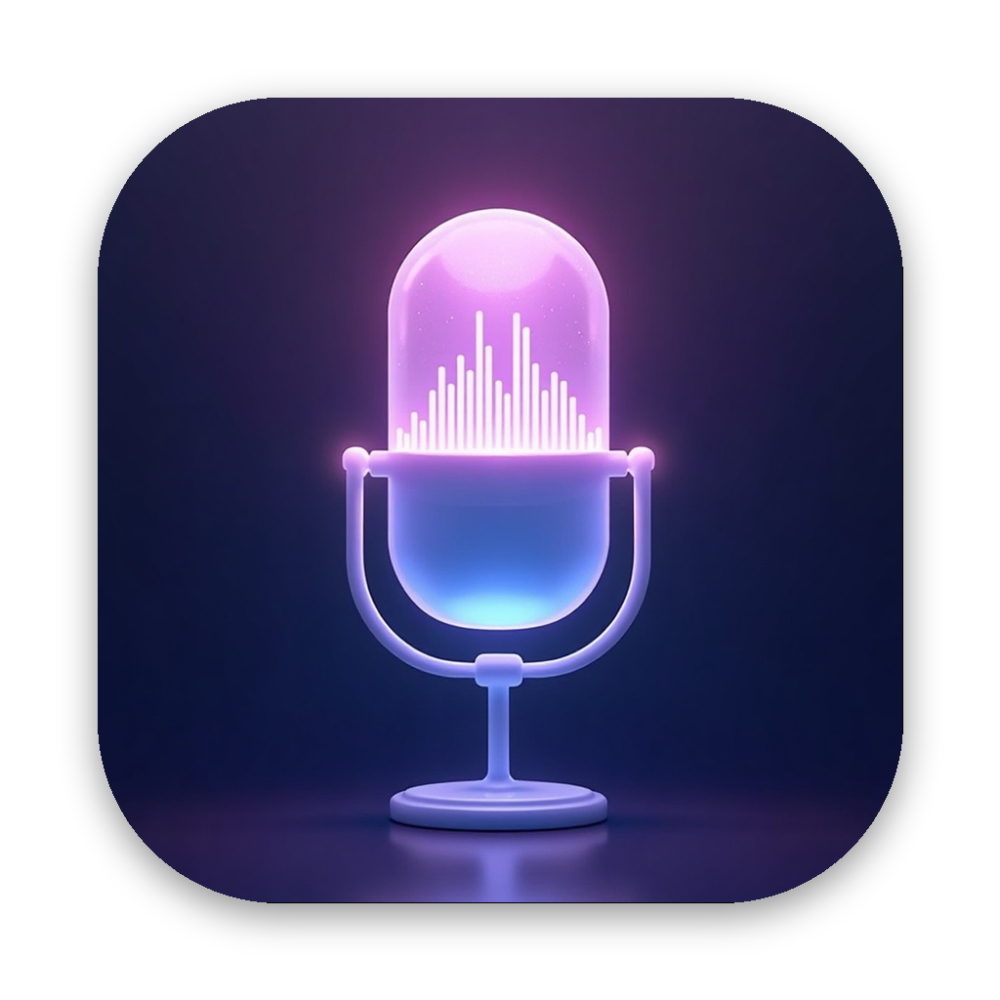

<div align="center">
  
  <h1>vlow</h1>
  <p><strong>Voice dictation for macOS that runs on your Mac.</strong></p>
</div>

Double-tap a modifier key, talk, double-tap again — the text is pasted into
whatever app you were in. Transcription happens on-device through MLX, with
no network and no API key. Apple Silicon only; tested on macOS 26.

```bash
brew install --cask --no-quarantine mcurses/vlow/vlow
```

Or grab the `.dmg` from [Releases](https://github.com/mcurses/vlow/releases)
and drag it to Applications. The bundle is self-contained — its own Python,
MLX and overlay, nothing else to install. On first launch vlow opens Settings
and asks you to download a model (~2.5–3 GB, once).

## What makes it different

Local dictation apps are not rare. These three things are:

**It picks local or cloud for you.** Set the backend to *auto* and short
recordings stay on-device while long ones — where a cloud model's accuracy
and speed actually pay off — go to AssemblyAI. Every other hybrid app makes
you flip a switch by hand, in the middle of talking.

**The gesture chooses the pipeline.** Double-tap gets you batch dictation:
record, transcribe, one clean paste. *Hold* the same key and you get live
streaming instead, with each finalized turn pasted as it arrives. One key,
two fundamentally different paths, no mode to remember.

**MLX under the hood.** Roughly 2× faster than the whisper.cpp everyone else
builds on, and Parakeet runs at ~25× realtime — a minute of speech
transcribed in about two seconds, entirely offline.

## A few details worth knowing

- **Two on-device models.** Whisper large-v3 for monolingual accuracy;
  Parakeet TDT v3 for speed and for mixed German/English, which Whisper
  mangles because it commits to one language per 30-second window.
- **Known words.** A list of names and jargon that biases every backend —
  prompt for Whisper, key terms for AssemblyAI, fuzzy post-correction for
  Parakeet.
- **Nothing is lost.** Every session writes its raw audio to disk *before*
  any transcription, including a partial save if vlow is killed mid-sentence.
  Re-run it later with `vlow transcribe`.
- **It pastes where you meant.** Batch recordings remember which app you
  started in, paste there, and hand focus back to where you are now.
- **A real Settings window.** Native SwiftUI, no Save button, everything
  applies live — hotkey, backend, models with download progress, keys,
  known words, start-at-login.
- **It updates itself.** A daily check against GitHub Releases; one click
  downloads, swaps the app and relaunches.

> **On the "no network" claim:** it holds for the on-device backend. In
> *auto* mode anything over the threshold (60 s by default) is uploaded to
> AssemblyAI, and ordinary dictation crosses a minute often. See
> [Configuration](docs/configuration.md#transcription-backends).

## Also a CLI

```bash
vlow transcribe interview.m4a > interview.txt
```

Any format ffmpeg reads, several files at once, through the same backend and
known-words biasing as dictation.

## Documentation

| | |
|---|---|
| [Usage](docs/usage.md) | Gestures, modes, the menubar, input devices, the CLI, recovery |
| [Configuration](docs/configuration.md) | Backends, models, AssemblyAI, known words, start-at-login, `config.toml` |
| [Troubleshooting](docs/troubleshooting.md) | Permissions, wedged app, logs, Gatekeeper |
| [Development](docs/development.md) | Running from source, building the DMG, releasing, repo layout |

## License

MIT — see [LICENSE](LICENSE).
